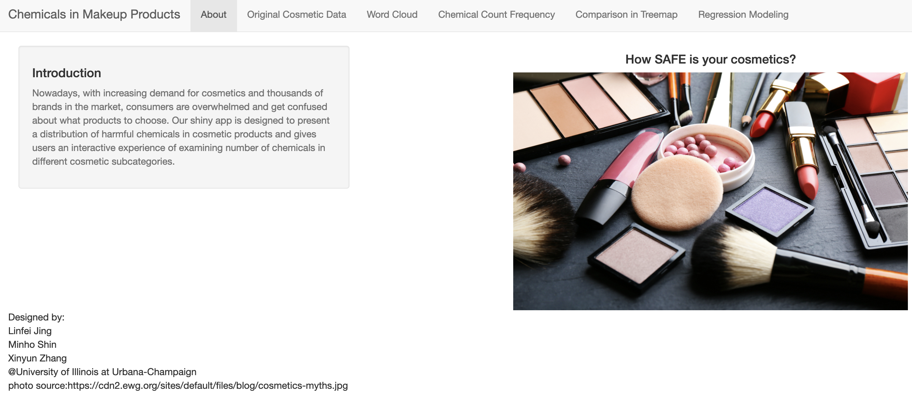
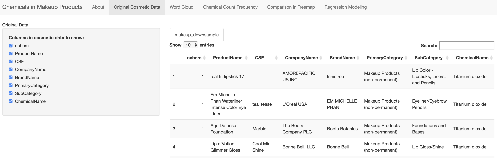
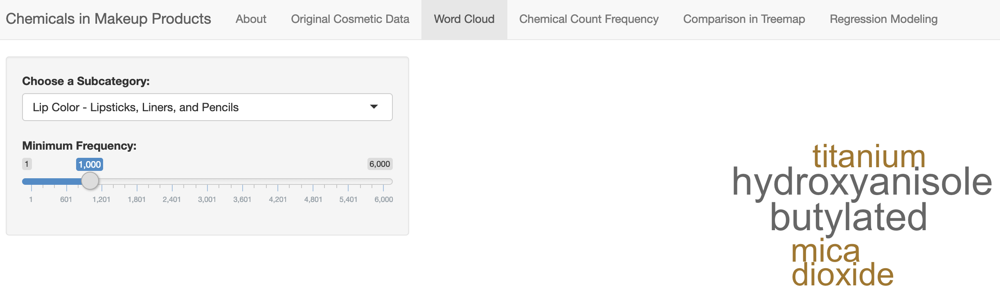
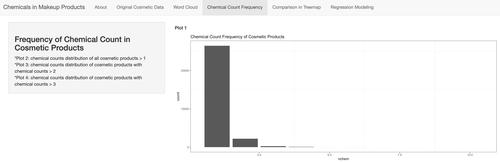
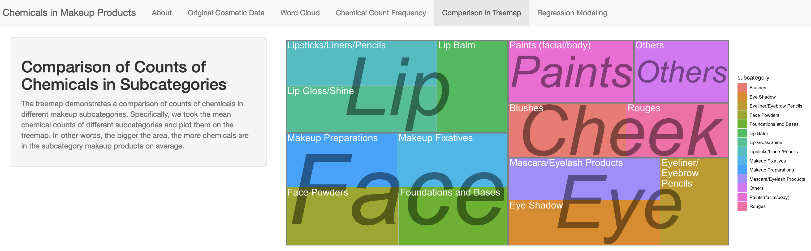
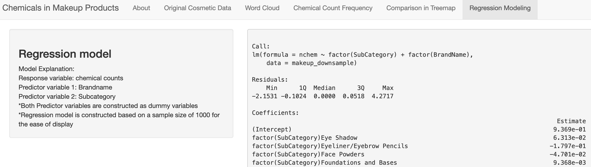

## Makeup Project

Within this repository is a donated project from Spring 2018 that was created in
STAT 385 by Linfei Jing, Minho Shin, and Xinyun Zhang. The goal of the project
was to analyze a "large-ish" data set and present findings in an interactive way.
Students completed this work by using:

- _Downsampling_ to load only a portion of the data;
- _Caching_ to speed up costly calculations;
- Manipulating data with 
  [`dplyr`](https://cran.r-project.org/package=dplyr),
  [`tm`](https://cran.r-project.org/package=tm), and base R functions;
- Displaying the data with an interactive table created by [`DT`](https://cran.r-project.org/package=DT);
- Visualizing data using [`treemap`](https://cran.r-project.org/package=treemap), [`wordcloud`](https://cran.r-project.org/package=wordcloud), and [`ggplot2`](https://cran.r-project.org/package=ggplot2);
- Modeling chemical information counts by brand and subcategory; and
- Communicating the result by creating a [`shiny`](https://cran.r-project.org/package=shiny) Application.

**Note:** The use of downsampling and caching were motivated by computational 
limitations enforced by the [RStudio Cloud: Alpha Version](https://rstudio.cloud)
of _1GB_ per session.

### Usage

The shiny application can be downloaded and used directly from GitHub with:

```r
# Install the shiny package if not present
if (!requireNamespace('shiny')) install.packages("shiny")

# Launch the Shiny Application and install packages
shiny::runGitHub("demo-makeup-project", "stat385uiuc")
```

### Examples

#### Welcome Splash 

When users launch the application, they are greeted with an overview of
the project. 



#### Data Viewer 

Under the "Original Cosmetic Data" panel, the data set is presented in an
interactive table using the [`DT`](https://cran.r-project.org/package=DT) package.^[
The [`DT`](https://cran.r-project.org/package=DT) package provides an interface
to the [`DataTables`](http://datatables.net/) javascript library.] 
In this setting, the data can be sorted, searched, or subset without needing
to know _R_ syntax.



#### Word Cloud

The degree that chemicals appeared in specific make up types is displayed
in a word cloud. The frequency information for the word cloud was generated
in advance on the full data set using the [`tm`](https://cran.r-project.org/package=tm)
package, stored, and then called as needed.



#### Chemical Count Frequency

The next component involved breaking down the frequency of chemicals within
all cosmetic products. To visualize the amount, the data set was trimmed on
each successive bar plot. The goal was to emphasize that a majority of makeup
products only predominately use 1 product as the `y`-axis drastically is reduced
on each successive subset.



#### Comparison in Treemap

The last visualization focused on breakdown frequency counts by where the makeup
was applied and the subcategory.



#### Regression Modeling

As a final component of the application, they made available a regression model
that sought to emphasis the number of chemicals present in makeup for a specific
brand and make up type. The model was fit using a downsampled data set as using
the full data resulted in a fit model with over ~300 MB of space.^[Due to 
computational limits of the environment care was required to use less than
the **1 GB** of available RAM.]



